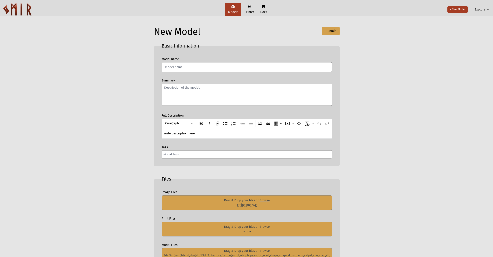
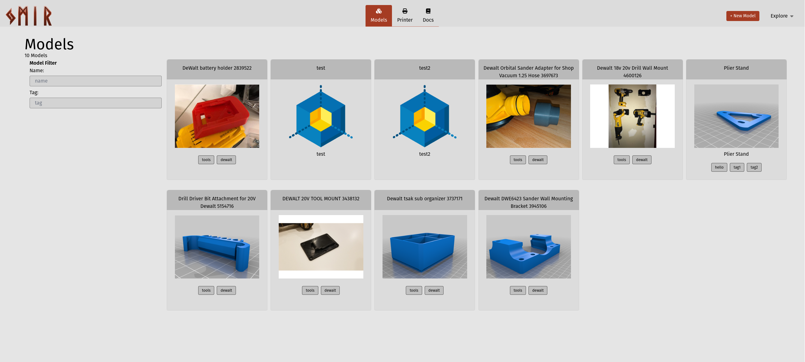
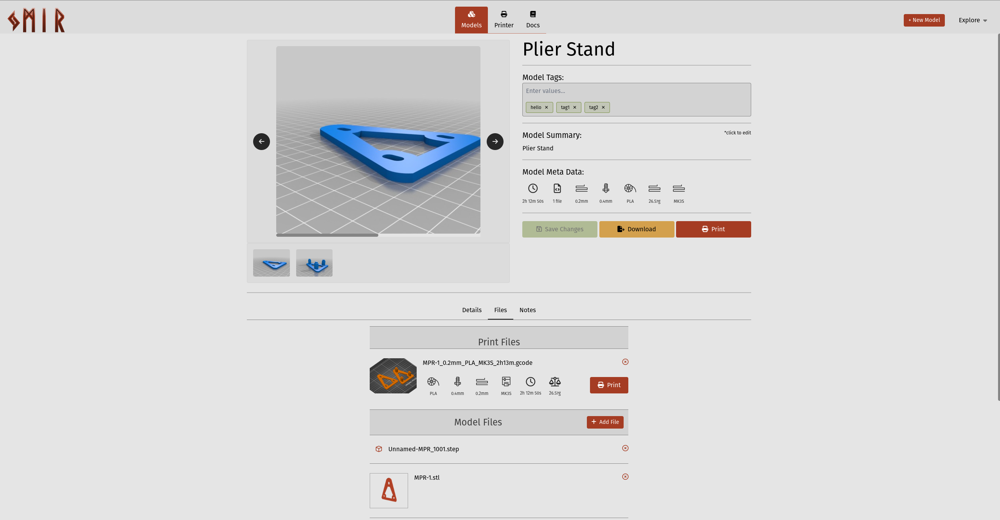
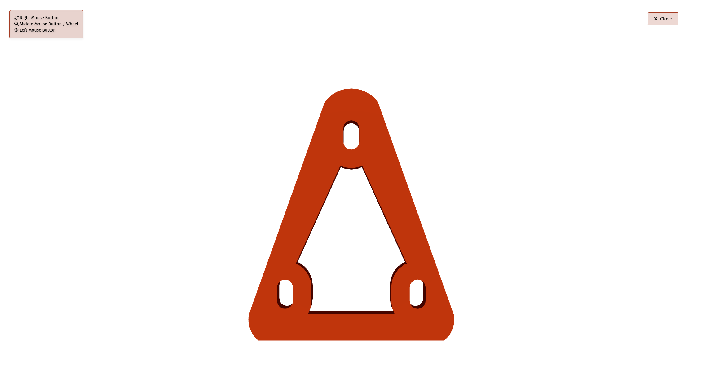

# Ymir
Last Update: 8Jan24

Ymir is a 3D model manager. In a nutshell it is a light and local version of the printables.com website.

## About
While I love what the folks at Prusa (and Free3D) are doing, I created Ymir for a few reasons.
First I am selfish and dont want to share my models with the whole world. Second I wanted a
model manager that can tie into my printer and print directly to it (yes I know about Octoprint.
More on that later). I also did not want it to be tied to a specific printer brand like printables.com is.
Right now Ymir will only connect to printers using OctoPrint.

I get why Prusa does that and Im cool with it. In fact I own a Prusa printer myself. But a lot of folks dont. 
Plus Im pretty sure my next printer is gonna be a Voron. Lastly I wanted something I could run locally and
not have to create an account on.

## Thank you:
* Your Name Here <-- Always looking for help

## Features
* Add, edit, and delete model
  
* Search for models by name or tag
  
* View model details
  
* View model stl files in 3D
  
* View model print details from Gcode
* view model images
* Add notes about a model
* Tag models
* Add, remove printers
* Print models
* Import Models from local disk

And did I mention Ymir has a built-in STL viewer.

## Installing
Right now you will have to build it yourself.  Im working on getting binary releases into Github

To build it you will need a few things installed:
* [npm](https://docs.npmjs.com/downloading-and-installing-node-js-and-npm)
* [golang](https://go.dev/)
* [gox](https://github.com/mitchellh/gox) <- Used for cross-platform compilation

First Build the UI
```bash
cd front
npm run build
```

Then Build the API Server
```bash
make build
```

This will embed the UI in the go executable

## Makefile
```
deps              Download and Install any missing dependecies
build             Install missing dependencies. Builds binary in ./build
dist              Creates a distribution
tidy              Verifies and downloads all required dependencies
fmt               Runs gofmt on all source files
test              Tests code coverage
testwithcoverge   Tests code coverage
missing           Displays lines of code missing from coverage. Puts report in ./build/coverage.out
vet               Run go vet.  Puts report in ./build/vet.out
reports           Runs vet, coverage, and missing reports
clean             Removes build, dist and report dirs
gencerts          Generates a sample self signed cert and key to enable TLS
debug             Print make env information
```

## Running
There are 2 components:
* The UI -- This is a Sveltekit app
* The API Server -- built in go

You can run the UI separately in dev mode with:
```bash
cd front
npm run dev
```
or

```bash
Usage:
  ymir [command]

Available Commands:
  completion  Generate the autocompletion script for the specified shell
  db          db command
  help        Help about any command (each subcommand also has help)
  import      import command.  Import models into ymir
  serve       Starts the ymir server
  version     Displays ymir version information
```

## Config
A default config file is in the [config](config/ymir.toml) folder.  Most of these config 
options should be pretty self-explanatory.  But I'll add more docs in a bit.

```toml
printConfig = false

[logging]
logFile = "log/ymir.log"
logLevel="DEBUG"
stdOut = true
fileOut = false

[datastore]
dbFile="ymir2.db"

[models]
uploadsTempDir="uploads/tmp"
modelsDir="uploads/modelFiles"

[printers]
printersDir="uploads/printers"

[http]
hostname = "0.0.0.0"
port = "8081"
usehttps = false
TLSMinVersion = "1.2"
HttpTLSStrictCiphers = false
TLSCert = "ymir.crt"
TLSKey = "ymir.key"
enableCORS = true
JWTSecret = "abc123"

[http.logging]
enabled = true
stdOut = false
fileOut = true
logFile = "log/ymir_http.log"
```

## Docs
A users manual is coming soon.

## TODOs
* Full Docs site
* Docker build
* Clean up the codebase -- This was my first time creating a svelte app
